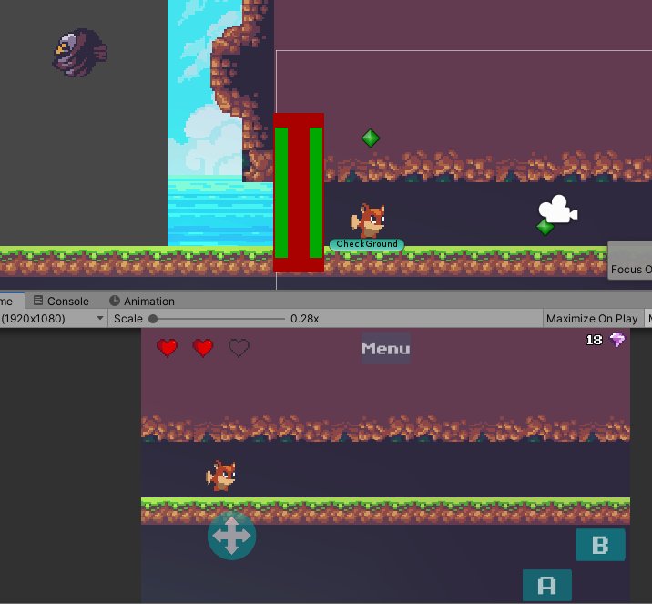
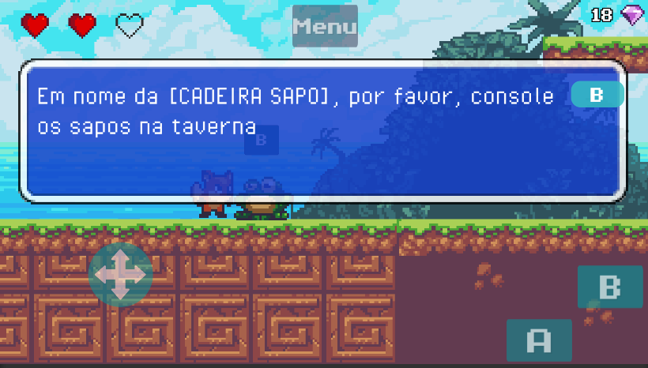

# FoxTale

# Play Here on Desktop Browser
http://azure.infordoc.com/Maikson/Bootstrap/FoxTaleWeb/index.html

A Repository for a completed Staged/MetroidVania Game Example
<br 

# Rooms System easy to setup

# Room System In-Game

# Working Checkpoints

# Dialogs easy to setup, a simple txt file

# Dialogs In-Game

# Stage Ending

# World Map
-Stage Select
-Keep Track "Save System" (multi Platform)
-Keep track of Collectibles and Time

# Final Boss

# Game Ending
-Bring back the FROG CHAIR to the frogs!!!

# Stage Ending

# State Machine Scripting for Boss Behavior

# Player Controller on Good Practices
-Physics is handled in FixedUpdate to check booleans
-Controls is based on boolean checks in FixedUpdate

# Cool Effects using Unity built-in Shader / Universal Render Pipeline

