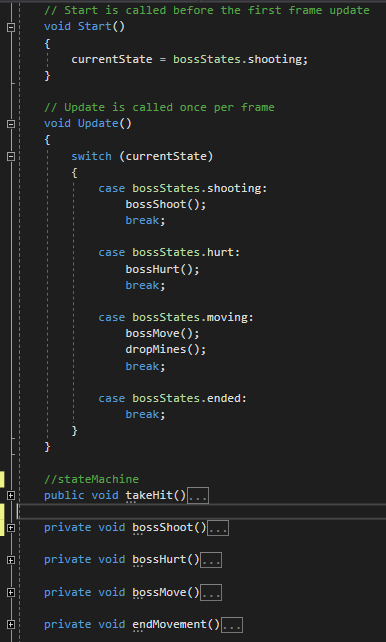

# FoxTale
this project is to showcase my skills in Unity3D and Coding.
Those having the objectives in mind:

## A Repository for a completed Staged/MetroidVania Design
- [x] A example of good practices
- [x] Complete and functional Game start to finish
- [x] Keep it simple platformer
- [x] Make use at least once of each Unity3D features for 2D Games
- [x] Game feel improvement techniques

# Play Here on Desktop Browser
https://maiksonstrife.github.io/FoxTalePlayGitPage/
<h4>CONTROLS:</h4>
Walking: "W", "D" 
Jumping: "Space" 
Action: "B" 
Change Screen Size: "ESC" Fullscreen (Native: 1080p) / Windowed (Forced: 720p)

## This project was made possible by the following Graphics assets:
### Stages Art
[Sunny Land By Ansimuz (stages graphics)](https://assetstore.unity.com/packages/2d/characters/sunny-land-103349) 
[Gothicvania Swamp Art By Ansimuz (stages graphics)](https://assetstore.unity.com/packages/2d/characters/gothicvania-swamp-152865) 
[Sunny Land Forest By Ansimuz (stages graphics)](https://assetstore.unity.com/packages/2d/characters/sunny-land-forest-108124) 
[Nameless: The Hackers RPG Soundtrack (Music)](https://freemusicarchive.org/music/BoxCat_Games/Nameless_the_Hackers_RPG_Soundtrack) 
### Unity3d Improvements
[Decorate Foldout (Unity3D inspector improvement asset)](https://github.com/PixeyeHQ/InspectorFoldoutGroup)

# Game Features snippets

## Rooms System easy to setup

## Room System In-Game

## Working Checkpoints

## Dialogs easy to setup on txt file

## Dialogs In-Game

## Stage Ending

## World Map
-Stage Select 
-Keep Track on Progression: Save System (multi Platform) 
-Keep track of Collectibles and Time 

## Final Boss

## Game Ending
-Bring back the FROG CHAIR to the frogs!!! 

## State Machine Scripting for Boss Behavior

## Player Controller on Good Practices
-Physics is handled in FixedUpdate to check booleans 
-Controls is based on boolean checks in FixedUpdate 

## Cool Effects using Universal Render Pipeline + 2D Shader Graph

## Other Techniques to Improve Gameplay
- [x] Ghost Jump (A quick timer when player falls of the ground: It does not penalize too much on mistake by giving a small window to still be able to jump)
- [x] Flash Sprites (Visual response to the game damage feedback)
- [x] Smooth Camera (using linear interpolation)
- [x] Camera moving ahead of player (when player changes direction the camera position goes a little ahead to his facing position)
- [x] Screenshake (visual response to the game feedback)

